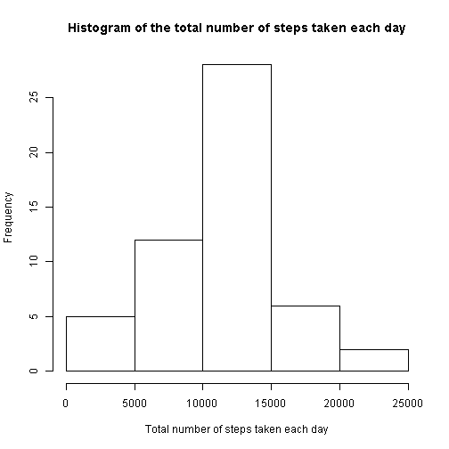
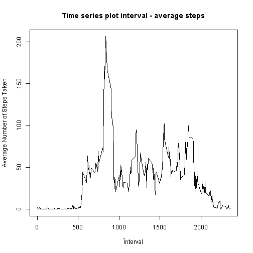
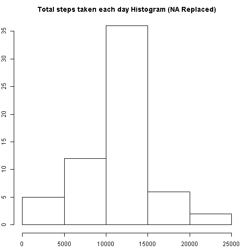
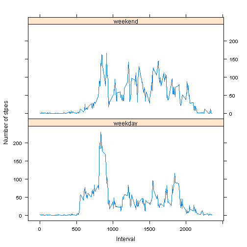

# **Reproducible Research: Peer Assessment 1**
## Instruction
This assignment will be described in multiple parts. You will need to write a report that answers the questions detailed below. Ultimately, you will need to complete the entire assignment in a single R markdown document that can be processed by knitr and be transformed into an HTML file.

Throughout your report make sure you always include the code that you used to generate the output you present. When writing code chunks in the R markdown document, always use echo = TRUE so that someone else will be able to read the code. This assignment will be evaluated via peer assessment so it is essential that your peer evaluators be able to review the code for your analysis.

For the plotting aspects of this assignment, feel free to use any plotting system in R (i.e., base, lattice, ggplot2)

Fork/clone the GitHub repository created for this assignment. You will submit this assignment by pushing your completed files into your forked repository on GitHub. The assignment submission will consist of the URL to your GitHub repository and the SHA-1 commit ID for your repository state.  

## **0. Preparation of running program**
Install knitr package

```r
library(knitr)
```


Set Directory

## **1. Loading and preprocessing the data**  
## 1.1 Load the data   
### 1.1.1 Read Data
Start by reading data from the zip file "activity.zip" using read.csv() function and store as **act_df** data frame

```r
act_df <- read.csv(unz("activity.zip", "activity.csv"))
```

### 1.1.2 Check Data
Check data by following method  
1) Check the first part of data

```r
head(act_df)
```

```
##   steps       date interval
## 1    NA 2012-10-01        0
## 2    NA 2012-10-01        5
## 3    NA 2012-10-01       10
## 4    NA 2012-10-01       15
## 5    NA 2012-10-01       20
## 6    NA 2012-10-01       25
```

2) Check the summary of data (Notice that there're 288 interval in each day)

```r
summary(act_df)
```

```
##      steps               date          interval   
##  Min.   :  0.0   2012-10-01:  288   Min.   :   0  
##  1st Qu.:  0.0   2012-10-02:  288   1st Qu.: 589  
##  Median :  0.0   2012-10-03:  288   Median :1178  
##  Mean   : 37.4   2012-10-04:  288   Mean   :1178  
##  3rd Qu.: 12.0   2012-10-05:  288   3rd Qu.:1766  
##  Max.   :806.0   2012-10-06:  288   Max.   :2355  
##  NA's   :2304    (Other)   :15840
```


## **2. What is mean total number of steps taken per day?**
## 2.1 Make a histogram of the total number of steps taken each day
### 2.1.1 Sum amount of step in each date
Prepare the histogram data by summing the amount of step in each date by creating **step_day** data frame for sum of step in each date

```r
step_day <- tapply(act_df$steps, act_df$date, sum)
```

### 2.1.2 Plot the histogram
Plot the histogram using hist() function

```r
step_day_main <- "Histogram of the total number of steps taken each day"
step_day_xlab <- "Total number of steps taken each day"
hist(step_day, main = step_day_main, xlab = step_day_xlab)
```

 


## 2.2 Calculate and report the mean and median total number of steps taken per day
Calculate mean & median and put the result in the nice data frame

```r
mean_step_day <- mean(step_day, na.rm = TRUE)
median_step_day <- median(step_day, na.rm = TRUE)
mean_median_step_day <- data.frame(mean = mean_step_day, median = median_step_day)
mean_median_step_day
```

```
##    mean median
## 1 10766  10765
```


## **3. What is the average daily activity pattern?**
## 3.1 Make a time series plot (i.e. type = "l") of the 5-minute interval (x-axis) and the average number of steps taken, averaged across all days (y-axis)

### 3.1.1 Create the vector of interval
Start out by creating the vector of interval (We knew from the summary() that there are 288 intervals in each day)

```r
interval <- act_df$interval[1:288]
```


### 3.1.2 Find average step for each interval
using the for loop and stored in **avg_step** data frame

```r
avg_step <- 1:288
for (i in c(1:288)) {
    avg_step[i] <- mean(act_df$steps[act_df$interval == interval[i]], na.rm = TRUE)
}
```


### 3.1.3 Create data frame for the interval and its average steps
by storing it in **interval_df** data frame in order to prepare data for time series plotting

```r
interval_df <- data.frame(interval = act_df$interval[1:288], avg_step = avg_step)
```


### 3.1.4 Plot the times series plot
Finally, the times series plot

```r
plot(interval, avg_step, type = "l", main = "Time series plot interval - average steps", 
    ylab = "Average Number of Steps Taken", xlab = "Ïnterval")
```

 


## 3.2 Which 5-minute interval, on average across all the days in the dataset, contains the maximum number of steps?
Find the interval whose average number is the highest an put it in the nice data frame as usual (named **max_interval_df**)

```r
max_interval <- interval[avg_step == max(avg_step)]
max_interval_df <- data.frame(interval = max_interval, avg_step = max(avg_step))
max_interval_df
```

```
##   interval avg_step
## 1      835    206.2
```


## **4. Imputing missing values**
Note that there are a number of days/intervals where there are missing values (coded as NA). The presence of missing days may introduce bias into some calculations or summaries of the data.

## 4.1 Calculate and report the total number of missing values in the dataset 
i.e. the total number of rows with NAs
### 4.1.1 Check for variable containing NA 
Found out that NA exist only in **steps** column

```r
summary(act_df)
```

```
##      steps               date          interval   
##  Min.   :  0.0   2012-10-01:  288   Min.   :   0  
##  1st Qu.:  0.0   2012-10-02:  288   1st Qu.: 589  
##  Median :  0.0   2012-10-03:  288   Median :1178  
##  Mean   : 37.4   2012-10-04:  288   Mean   :1178  
##  3rd Qu.: 12.0   2012-10-05:  288   3rd Qu.:1766  
##  Max.   :806.0   2012-10-06:  288   Max.   :2355  
##  NA's   :2304    (Other)   :15840
```

### 4.1.2 Count the number of row with NAs

```r
sum(is.na(act_df$steps))
```

```
## [1] 2304
```

## 4.2 Devise a strategy for filling in all of the missing values in the dataset. 
(The strategy does not need to be sophisticated. For example, you could use the mean/median for that day, or the mean for that 5-minute interval, etc.)  

### 4.2.1 Find step mean for each interval
Store as data frame (named **avg_step_all**) in order to use as substitute for NA case in each interval

```r
avg_step_all <- seq_along(act_df$interval)
for (i in seq_along(act_df$interval)) {
    avg_step_all[i] <- interval_df$avg_step[interval == act_df$interval[i]]
}
```

### 4.2.2 Replace interval for each NA step case by mean value
using for loop and if condition and named the result data frame **steps_adj**

```r
steps_adj <- seq_along(act_df$interval)
for (i in seq_along(act_df$interval)) {
    if (is.na(act_df$steps[i])) {
        steps_adj[i] <- avg_step_all[i]
    } else {
        steps_adj[i] <- act_df$steps[i]
    }
}
```

Check for the first few row of result data frame

```r
head(steps_adj, 20)
```

```
##  [1] 1.71698 0.33962 0.13208 0.15094 0.07547 2.09434 0.52830 0.86792
##  [9] 0.00000 1.47170 0.30189 0.13208 0.32075 0.67925 0.15094 0.33962
## [17] 0.00000 1.11321 1.83019 0.16981
```


## 4.3 Create a new dataset that is equal to the original dataset but with the missing data filled in.
also showing the summary of data to compare between before-adjusted-steps, *steps_old*, and after-adjusted-step, *step_new*. (Notice that NA case is no more)

```r
act_df_narm <- data.frame(date = act_df$date, interval = act_df$interval, steps_old = act_df$steps, 
    step_new = steps_adj)
summary(act_df_narm)
```

```
##          date          interval      steps_old        step_new    
##  2012-10-01:  288   Min.   :   0   Min.   :  0.0   Min.   :  0.0  
##  2012-10-02:  288   1st Qu.: 589   1st Qu.:  0.0   1st Qu.:  0.0  
##  2012-10-03:  288   Median :1178   Median :  0.0   Median :  0.0  
##  2012-10-04:  288   Mean   :1178   Mean   : 37.4   Mean   : 37.4  
##  2012-10-05:  288   3rd Qu.:1766   3rd Qu.: 12.0   3rd Qu.: 27.0  
##  2012-10-06:  288   Max.   :2355   Max.   :806.0   Max.   :806.0  
##  (Other)   :15840                  NA's   :2304
```


## 4.4 Make a histogram of the total number of steps taken each day and Calculate and report the mean and median total number of steps taken per day.
Do these values differ from the estimates from the first part of the assignment? What is the impact of imputing missing data on the estimates of the total daily number of steps?

### 4.4.1 Make histogram
Create the data frame of total number steps taken each day, **step_day_narm**

```r
step_day_narm <- tapply(act_df_narm$step_new, act_df_narm$date, sum)
```

Find the date the appear in the data using the aid of duplicated() function

```r
date <- act_df$date[!duplicated(act_df$date)]
```

Revise the data frame **step_day_narm** by matching the unique date, *date*, and total number of step, *sup_step_day*, for plotting histogram 

```r
sum_step_day <- seq_along(date)
for (i in seq_along(date)) {
    sum_step_day[i] <- step_day_narm[date[i]]
}
step_day_narm <- data.frame(date = date, sum_step = sum_step_day)
```

Finally, the histogram is plotted

```r
step_day_narm_main <- "Total steps taken each day Histogram (NA Replaced)"
step_day_narm_xlab <- "Total number of steps taken each day"
par(mfcol = c(1, 1), mar = c(2, 2, 2.5, 1))
hist(step_day_narm$sum_step, main = step_day_narm_main, xlab = step_day_narm_xlab, 
    ylab = "frequency")
```

 


### 4.4.2 Compute mean and median
Compute mean & median and compare with before-NA-adjusted-case

```r
mean_narm <- mean(step_day_narm$sum_step)
median_narm <- median(step_day_narm$sum_step)
compare_mean_median <- data.frame(mean = mean_step_day, mean_narm = mean_narm, 
    median = median_step_day, media_narm = median_narm)
compare_mean_median
```

```
##    mean mean_narm median media_narm
## 1 10766     10766  10765      10766
```


## **5. Are there differences in activity patterns between weekdays and weekends?**
## 5.1 Create a new factor variable in the dataset with two levels - "weekday" and "weekend" indicating whether a given date is a weekday or weekend day.
Create **day_type** vector for classifying date to "weekday" and "weekend"

```r
a <- strptime(act_df_narm$date, format = "%Y-%m-%d")
b <- weekdays(a)
day_type <- seq_along(b)
for (i in seq_along(b)) {
    if (b[i] == "Saturday" | b[i] == "Sunday") {
        day_type[i] <- "weekend"
    } else {
        day_type[i] <- "weekday"
    }
}
day_type <- factor(day_type)
summary(day_type)
```

```
## weekday weekend 
##   12960    4608
```


## 5.2 Make a panel plot containing a time series plot (i.e. type = "l") of the 5-minute interval (x-axis) and the average number of steps taken, averaged across all weekday days or weekend days (y-axis). 

### 5.2.1 Preparing the data
Create **day_type_avg** data frame containing sum of step classify by *day_type - interval* combination to prepare for histogram plotting

```r
act_df_narm <- cbind(act_df_narm, day_type)

day_type_avg <- tapply(act_df_narm$step_new, list(act_df_narm$interval, act_df_narm$day_type), 
    mean)
interval2 <- c(interval, interval)
day_type2 <- c(rep("weekday", 288), rep("weekend", 288))
avg_value2 <- c(day_type_avg[, 1], day_type_avg[, 2])
day_type_avg <- data.frame(interval = interval2, day_type = day_type2, avg_value = avg_value2)
head(day_type_avg, 5)
```

```
##   interval day_type avg_value
## 1        0  weekday   2.25115
## 2        5  weekday   0.44528
## 3       10  weekday   0.17317
## 4       15  weekday   0.19790
## 5       20  weekday   0.09895
```

```r
tail(day_type_avg, 5)
```

```
##     interval day_type avg_value
## 572     2335  weekend   11.5873
## 573     2340  weekend    6.2877
## 574     2345  weekend    1.7052
## 575     2350  weekend    0.0283
## 576     2355  weekend    0.1344
```


Also checking the head and tail of the data

```r
head(day_type_avg, 5)
```

```
##   interval day_type avg_value
## 1        0  weekday   2.25115
## 2        5  weekday   0.44528
## 3       10  weekday   0.17317
## 4       15  weekday   0.19790
## 5       20  weekday   0.09895
```


```r
tail(day_type_avg, 5)
```

```
##     interval day_type avg_value
## 572     2335  weekend   11.5873
## 573     2340  weekend    6.2877
## 574     2345  weekend    1.7052
## 575     2350  weekend    0.0283
## 576     2355  weekend    0.1344
```

### 5.2.2 Plot the histogram
using the xyplot() function from lattice plotting system to plot the average number of teps in each interval seperated by day_type

```r
library(lattice)
xyplot(avg_value ~ interval | day_type, data = day_type_avg, type = "l", layout = c(1, 
    2), ylab = "Number of stpes", xlab = "Interval")
```

 

